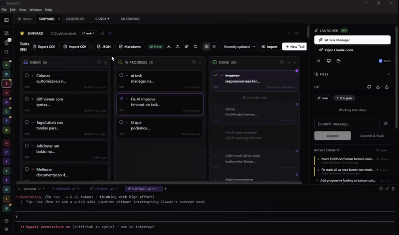

<p align="center">
  
</p>

<h1 align="center">Shipyard</h1>

<p align="center">
  <strong>A local-first command center for software projects.</strong><br />
  Projects, tasks, Git, terminals, files, and AI workflows in one focused workspace.
</p>

<p align="center">
  <a href="https://github.com/defremont/Shipyard/releases/latest"></a>
  <a href="https://github.com/defremont/Shipyard/releases"></a>
  <a href="https://github.com/defremont/Shipyard/actions/workflows/release.yml"></a>
  <a href="https://github.com/defremont/Shipyard/stargazers"></a>
  <a href="LICENSE"></a>
</p>

<p align="center">
  <a href="https://github.com/defremont/Shipyard/releases/latest"><strong>Download Shipyard</strong></a>
  ·
  <a href="#run-from-source">Run from source</a>
  ·
  <a href="#contributing">Contribute</a>
</p>

<p align="center">
  
</p>

## Why Shipyard?

Development work is spread across editors, terminal windows, Git clients, task boards, and AI tools. Shipyard brings the operational layer together without trying to replace your editor.

- **Local-first** — the dashboard and API run on your machine; project and task data stays in local JSON files.
- **Portfolio view** — see every project, active task, branch, and working tree from one place.
- **Fast project switching** — keep multiple workspaces open with responsive tabs and an overflow menu.
- **Built for AI-assisted development** — launch Claude Code with project/task context or expose Shipyard through MCP.
- **No database required** — installation, backup, inspection, and recovery remain straightforward.
- **Cross-platform** — desktop installers for Windows, macOS, and Linux, plus browser-based development mode.

## Highlights

| Area | What Shipyard provides |
|---|---|
| Dashboard | Project health, Git state, detected stack, task counts, favorites, and work-in-progress overview |
| Tasks | Milestone-scoped Kanban boards, priorities, technical prompts, timestamps, bulk actions, and global task view |
| Git | Status, diffs, history, branches, stage/unstage, commit, pull, push, and multi-repository projects |
| Terminals | Integrated xterm sessions, split panes, native launchers, dev servers, and Claude Code sessions |
| Files | Lazy file tree, previews, editing, filename search, and content search |
| AI | CLI-first Claude integration, task analysis, contextual chat, commit messages, and multi-task management |
| MCP | OAuth-protected tools for projects, milestones, tasks, Git status, and sync operations |
| Sync | Milestone-scoped Google Sheets, Trello, and ClickUp integrations |
| Desktop | Electron wrapper, native shortcuts, persistent local data, and platform installers |

### A terminal designed for AI workflows

The integrated terminal includes WebGL rendering, output batching, safe bracketed paste, reconnect handling, split panes, and session persistence. Clipboard images can be pasted with `Ctrl+V`: Shipyard stores the image temporarily on your machine and inserts its path into the Claude Code prompt.

### Minimal, scalable interface

Primary actions stay visible; secondary actions live in contextual menus. Project tabs adapt to the available width instead of introducing horizontal page scrolling, and the active project always remains accessible.

## Download

Use the latest CI-built installers from the [Releases page](https://github.com/defremont/Shipyard/releases/latest).

| Platform | Installer |
|---|---|
| Windows x64 | `Shipyard-Setup-<version>.exe` |
| macOS Apple Silicon | `Shipyard-<version>-arm64.dmg` |
| macOS Intel | `Shipyard-<version>-x64.dmg` |
| Linux x64 | `Shipyard-<version>.AppImage` or `Shipyard-<version>.deb` |

> Builds are currently distributed without a commercial code-signing certificate. Your operating system may show its standard warning for independently distributed open-source applications.

## Run from source

### Requirements

- [Node.js](https://nodejs.org/) 20 LTS or newer
- [pnpm](https://pnpm.io/installation)
- [Git](https://git-scm.com/)

```bash
git clone https://github.com/defremont/Shipyard.git
cd Shipyard
pnpm install
pnpm dev
```

Open [http://localhost:5421](http://localhost:5421). The frontend runs on port `5421` and the Fastify API on `5420`.

Setup helpers are also available:

```bash
# Linux / macOS
chmod +x setup.sh devdash.sh
./setup.sh
./devdash.sh

# Windows
setup.cmd
devdash.cmd
```

The first-run wizard helps discover project folders and explains the main workspace controls.

### Optional integrated terminal

The browser terminal uses `node-pty`, which is installed as an optional native dependency. If it is unavailable, the rest of Shipyard continues to work and terminal actions fall back to native operating-system terminals.

## Core workflows

### Manage projects

Add existing folders or scan a parent directory. Shipyard detects Git repositories, common technologies, branches, local changes, remotes, and one-level nested repositories. Favorite important projects or jump to any workspace with `Ctrl+K`.

### Plan and execute tasks

Each project has a virtual **General** milestone and can define additional milestones. Tasks move through Inbox, In Progress, and Done while preserving cascading timestamps. The description captures the product outcome; the technical prompt captures implementation context for a developer or coding agent.

### Work with Git

Inspect changes, review diffs, stage files, commit, synchronize with remotes, and browse history without leaving the workspace. Projects containing multiple independent repositories expose repository tabs and keep query state isolated per repository.

### Use Claude Code

Shipyard is CLI-first. Server-side AI features prefer the existing Claude Code OAuth session, then the local Claude CLI, and finally a configured API key. You can:

- open Claude Code in a project terminal;
- resolve one task with generated project context;
- organize or update multiple tasks from natural language;
- analyze tasks and generate implementation prompts;
- generate commit messages from the current diff;
- paste text or clipboard images into the integrated terminal.

AI features are optional; project, task, Git, file, and terminal management work without them.

### Connect through MCP

Shipyard includes a Model Context Protocol server with OAuth 2.1 and PKCE. Compatible agents can list projects and milestones, create or update tasks, inspect Git state, reorder work, and trigger configured sync providers. Connection instructions and consent controls are available under **Settings → MCP**.

### Synchronize milestones

Integrations are isolated by `(project, provider, milestone)`, so each milestone can connect to a different remote board, list, or sheet.

| Provider | Direction | Notes |
|---|---|---|
| Google Sheets | Bidirectional | Apps Script bridge, timestamp merge, automatic push and pull |
| Trello | Bidirectional | Board/list mapping, controlled card ordering, remote edit protection, retry handling |
| ClickUp | Bidirectional | List mapping with project and milestone isolation |

Credentials are configured once per provider; mappings and synchronization state remain local. Detailed setup guidance is built into Shipyard's **Help** and **Settings** pages.

## Keyboard shortcuts

| Shortcut | Action |
|---|---|
| `Ctrl+K` | Global project, task, and action search |
| `Ctrl+Shift+F` | Search file contents |
| `Ctrl+Backtick` | Toggle the integrated terminal |
| `Ctrl+V` | Paste text or a clipboard image into the terminal |
| `Shift` + drag | Select terminal text while mouse tracking is active |

On macOS, use `Cmd` for application shortcuts where applicable.

## Data and privacy

Shipyard does not require a Shipyard account or hosted database.

In development mode, data is written under `data/`. Desktop builds store it in the operating system's application-data directory. The main files are plain JSON and can be backed up with normal filesystem tools.

```text
data/
├── projects.json
├── settings.json
├── tasks/
│   └── <projectId>.json
├── sync-config.json
├── mcp-config.json
├── mcp-auth.json
└── server.log
```

Third-party features communicate only with the provider you configure, such as Anthropic, Google Apps Script, Trello, or ClickUp. Review those providers' privacy policies before enabling an integration.

## Architecture

```text
┌─────────────────────────────────────────────────────────────┐
│ React + Vite client                                         │
│ dashboard · tasks · Git · files · terminal · AI · settings │
└──────────────────────────────┬──────────────────────────────┘
                               │ REST / SSE / WebSocket
┌──────────────────────────────▼──────────────────────────────┐
│ Fastify server                                              │
│ routes · services · MCP · PTY · sync adapters · AI backend │
└───────────────┬──────────────────────────────┬──────────────┘
                │                              │
       ┌────────▼────────┐            ┌────────▼────────┐
       │ Local JSON data │            │ Local projects  │
       │ atomic + locked │            │ Git + filesystem│
       └─────────────────┘            └─────────────────┘
```

| Layer | Technology |
|---|---|
| Frontend | React 18, Vite, TypeScript, Tailwind CSS, shadcn/ui, React Query |
| Backend | Fastify 5, TypeScript, Zod, simple-git |
| Terminal | xterm.js, WebSocket, optional node-pty |
| Desktop | Electron, electron-builder |
| Persistence | Atomic JSON stores with in-process mutation locks |
| Monorepo | pnpm workspaces |

### Repository layout

```text
client/src/       React application, components, hooks, and API client
server/src/       Fastify routes and domain services
electron/         Desktop process, preload bridge, and packaging hooks
assets/           Icons and README media
data/             Local development data (generated and gitignored)
.github/workflows Release automation for Windows, macOS, and Linux
```

## Development

```bash
pnpm dev              # frontend + backend with watch mode
pnpm build            # production client, server, and Electron build
pnpm dist:win         # Windows installer
pnpm dist:mac         # macOS DMGs
pnpm dist:linux       # Linux AppImage and deb
```

The codebase intentionally avoids a database and keeps its data stores recoverable. Before contributing architecture, route, model, or convention changes, read [`AGENTS.md`](AGENTS.md).

## Contributing

Contributions, bug reports, and focused feature proposals are welcome.

1. Fork the repository.
2. Create a branch from `main`.
3. Install dependencies with `pnpm install`.
4. Make a scoped change and update documentation when behavior changes.
5. Run `pnpm build` and test the affected workflow.
6. Open a pull request explaining the problem, solution, and validation.

UI changes should use the existing design tokens and shadcn/ui primitives. New task mutations must invalidate both project tasks and the global task query. New JSON stores must use serialized mutations and atomic writes.

## Release process

Pushing a `v*` tag starts the GitHub Actions release workflow. It builds Windows, macOS Intel/Apple Silicon, AppImage, and Debian artifacts, then creates a draft GitHub release with generated notes and attached installers.

## License

Shipyard is available under the [Apache License 2.0](LICENSE).

If Shipyard improves your development workflow, consider [starring the repository](https://github.com/defremont/Shipyard) or sharing what you build with it.